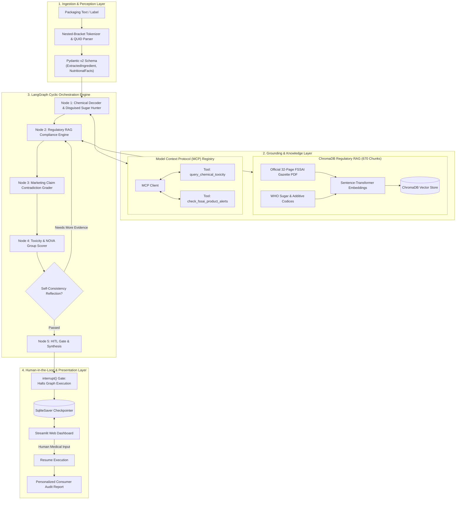

# NutriPure AI 🌿
### Know What’s Really Inside Your Food
**Autonomous Food Truth, Chemical Deconstructor & Deceptive Marketing Auditor**

[](https://www.python.org/)
[](https://github.com/langchain-ai/langgraph)
[](https://www.trychroma.com/)
[-purple.svg)](https://modelcontextprotocol.io/)
[](https://langchain-ai.github.io/langgraph/)

An enterprise-grade autonomous AI system designed to audit packaged food labels, expose deceptive front-of-pack marketing claims, decode cryptic INS/E-number additives, and enforce personalized medical constraints (Diabetes, Allergies, Pediatric safety) using **LangGraph**, **ChromaDB Regulatory RAG**, and Anthropic's **Model Context Protocol (MCP)**.

---

## 🎯 The Problem Solved
Packaged food brands regularly deceive consumers by printing bold claims on the front of packages—such as **"100% Atta / Whole Wheat"**, **"No Added Sugar"**, or **"100% Natural"**—while concealing refined flour (Maida), high-glycemic disguised starches (Maltodextrin, Invert Sugar), and toxic preservatives (Sodium Benzoate, Caramel Color IV) on the back.

Generic LLMs fail at auditing food products because they hallucinate regulatory standards, miss disguised chemical synonyms, and cannot safely account for individual medical conditions.

**NutriPure AI solves this through a 5-tier grounded architecture:**
1. **Perception & QUID Extraction:** Extracts ingredient percentages (e.g., *Maida 62%, Atta 24%*) using a nested-bracket tokenizer and Pydantic v2 schemas.
2. **Regulatory Grounding (RAG):** Ingests the **32-page official Government of India FSSAI Gazette Notification PDF** and WHO standards across **670 chunks** in ChromaDB.
3. **Tool Protocol (MCP):** Connects to external chemical registries (PubChem / OpenFoodFacts) and live government recall feeds via standardized **Model Context Protocol (MCP)** tools.
4. **Agentic Brain (LangGraph):** Executes a cyclic state machine with contradiction grading, NOVA ultra-processed classification, and reflection loops.
5. **Human-in-the-Loop (HITL):** Uses `SqliteSaver` and LangGraph's `interrupt()` primitive to halt execution and adapt verdicts to individual medical profiles.

---

## 🏛️ System Architecture



---

## 🔬 Benchmark Dataset & Verification Results

NutriPure AI was evaluated against a benchmark test suite of real-world food formulations modeled after commercial Indian market products:

| Product Name | Front Marketing Claim | Back-of-Pack Reality | LangGraph Verdict | Legal / Health Citation |
| :--- | :--- | :--- | :---: | :--- |
| **VitaWheat Digestives** | *"100% Whole Wheat Atta"* | Maida 62%, Atta 24%, Palm Oil | **UNHEALTHY / MISLEADING** (NOVA 4) | **FSSAI Section 7** (Mandatory $\ge 60\%$ Whole Wheat threshold). |
| **ChocoMalt Power Drink** | *"No Added Sugar"* | 26% Maltodextrin (GI > 110), Sucralose | **UNHEALTHY / MISLEADING** (NOVA 4) | **FSSAI Schedule II, Section 4** (Maltodextrin bulking prohibition). |
| **RealBerry Fruit Nectar** | *"100% Natural & No Preservatives"* | 12% Fruit, Sodium Benzoate, Carmoisine | **UNHEALTHY / MISLEADING** (NOVA 4) | **FSSAI Regulation 4** & WHO Benzene formation carcinogen alert. |
| **ProMax Keto Protein Bar** | *"Clean Nutrition, Keto Friendly"* | Palm Kernel Oil, Caramel IV (INS 150d) | **UNHEALTHY / MISLEADING** (NOVA 4) | Contains **INS 150d** with trace 4-MEI carcinogen. |
| **PureGrain Rolled Oats** | *"100% Whole Oats, Single Ingredient"* | 100% Whole Grain Oats | **CLEAN** (NOVA 1) | Zero violations, zero false alarms. |

---

## ⚡ Key Engineering Innovations

### 1. Nested-Bracket Negative Lookahead Tokenizer
Standard `text.split(',')` crashes on complex labels like `Raising Agents [INS 503(ii), INS 500(ii)]`. We engineered a regex negative lookahead pattern `r',\s*(?![^(\[]*[)\]])'` that splits only at ingredient boundaries while keeping nested additive groups intact.

### 2. Dual-Format RAG with Page-Level Citations
Ingests both cleaned Markdown guidelines and an authentic **32-page official Government of India Gazette PDF** using `pypdf`. Every chunk maintains metadata enabling citations like:
> *"FSSAI Advertising and Claims Regulation 2020, Section 7, Page 14."*

### 3. Model Context Protocol (MCP) Standard
Standardized tool execution over JSON-RPC contracts for external chemical lookups (`query_chemical_toxicity`) and live government advisories (`check_fssai_product_alerts`), decoupling the agent from external APIs.

### 4. Human-in-the-Loop (HITL) with `SqliteSaver`
Uses LangGraph's `interrupt()` primitive to freeze execution before report synthesis. When a user supplies their medical profile (e.g., *Diabetic = True, Allergies = ['Gluten']*), the state machine resumes from the SQLite database to generate personalized medical warnings.

---

## 🚀 Quickstart Guide

### 1. Clone & Set Up Environment
```bash
git clone https://github.com/ShivaliGupta17/nutripure-ai.git
cd nutripure-ai

# Create virtual environment
python -m venv venv
.\venv\Scripts\activate

# Install dependencies
pip install -r requirements.txt
```

### 2. Run Automated Verification Tests
```bash
# Day 2: Test Pydantic schemas & QUID extraction
python tests/test_day2.py

# Day 3: Test ChromaDB regulatory RAG & 32-page PDF ingestion
python tests/test_day3.py

# Day 4: Test Model Context Protocol (MCP) tool catalog
python tests/test_day4.py

# Day 5: Test LangGraph multi-node state machine
python tests/test_day5.py

# Day 6: Test Human-in-the-Loop (HITL) interrupt & state resumption
python tests/test_day6.py
```

### 3. Launch the Interactive Web Dashboard
```bash
streamlit run app.py
```
Open `http://localhost:8501` in your browser.

---

## 📄 License
MIT License. Built for educational and demonstration purposes.
